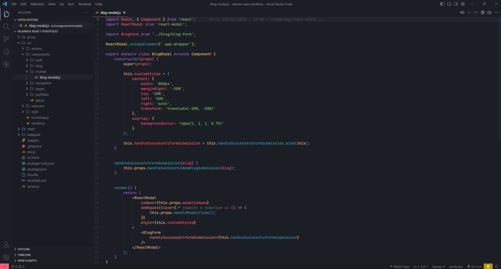
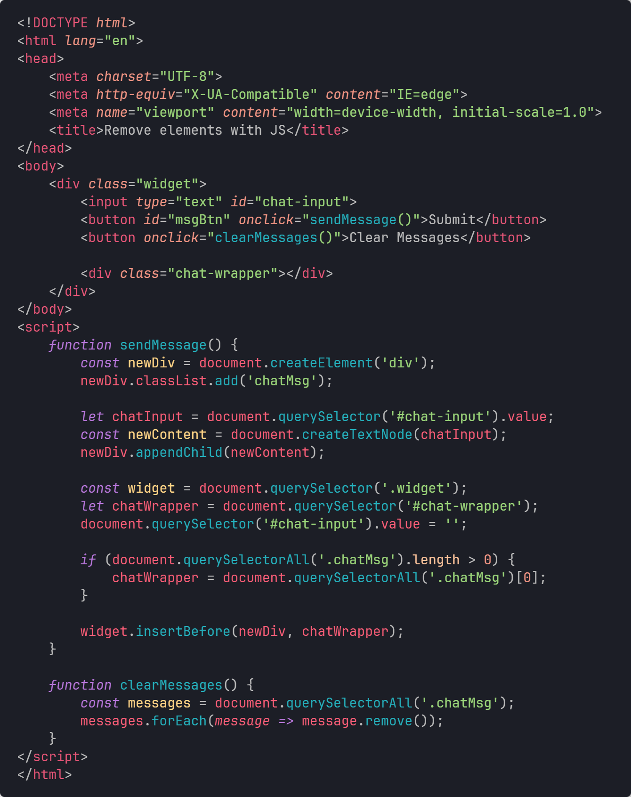
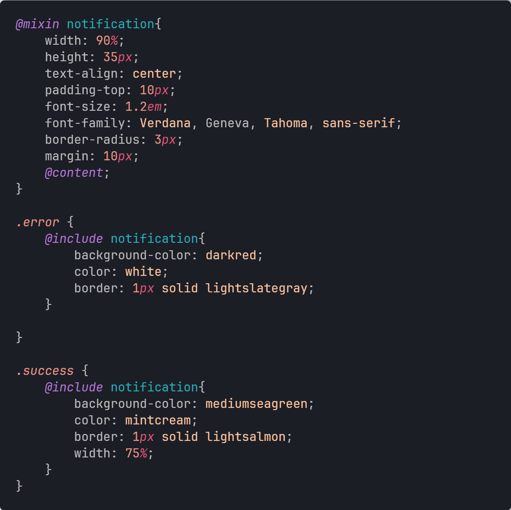

# Larrea Dark theme

This is the **Larrea Dark** theme! The Horizon Theme based new dark theme for VS Code.

 
 

## Snapshots

* **Larrea Dark**

 

* **HTML with JS**

 

* **SCSS**

 

* **Python**

 

> The used font in the snapshots is [JetBrains Mono](https://www.jetbrains.com/lp/mono/).

 
 

## Repository

View the repository on [GitHub](https://github.com/nlarrea/larrea-dark-theme)!

If you would like to create a new Issue or PR, please do so!